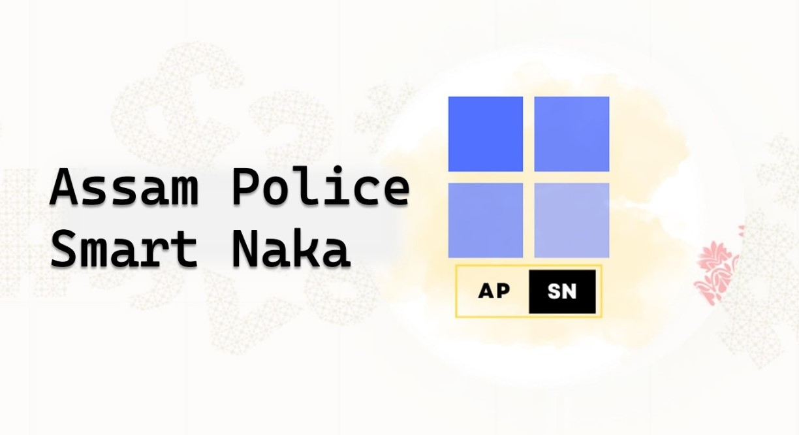
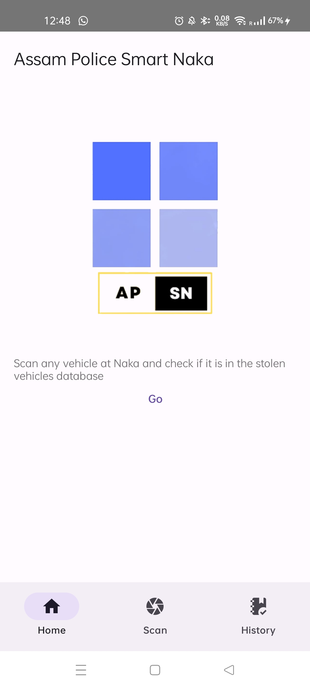
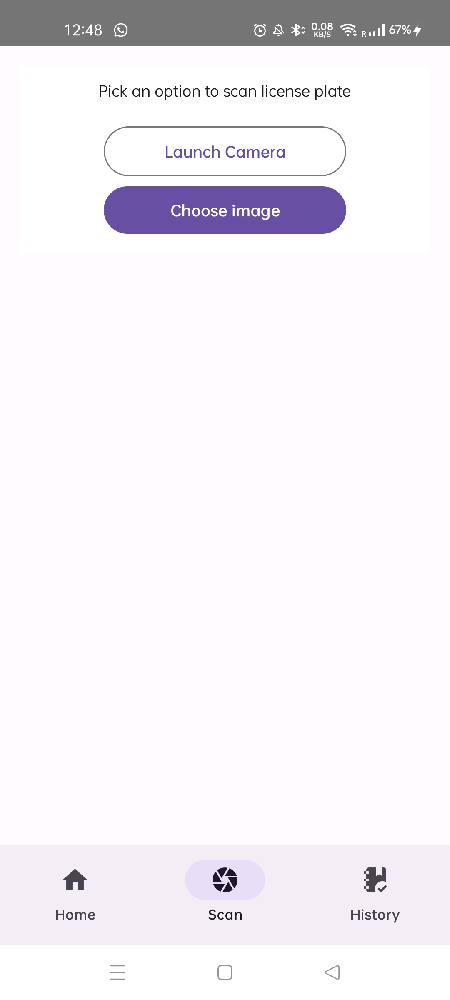
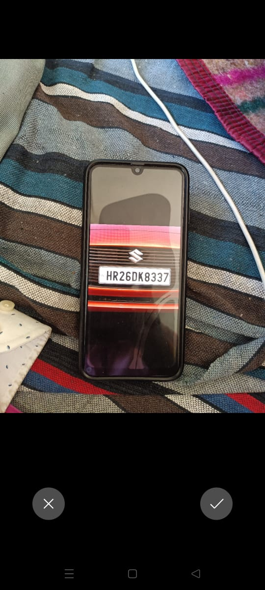
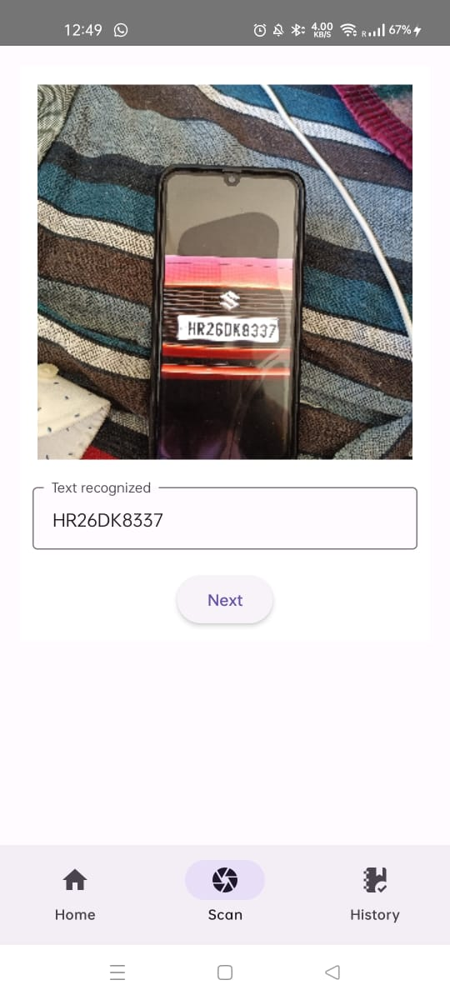
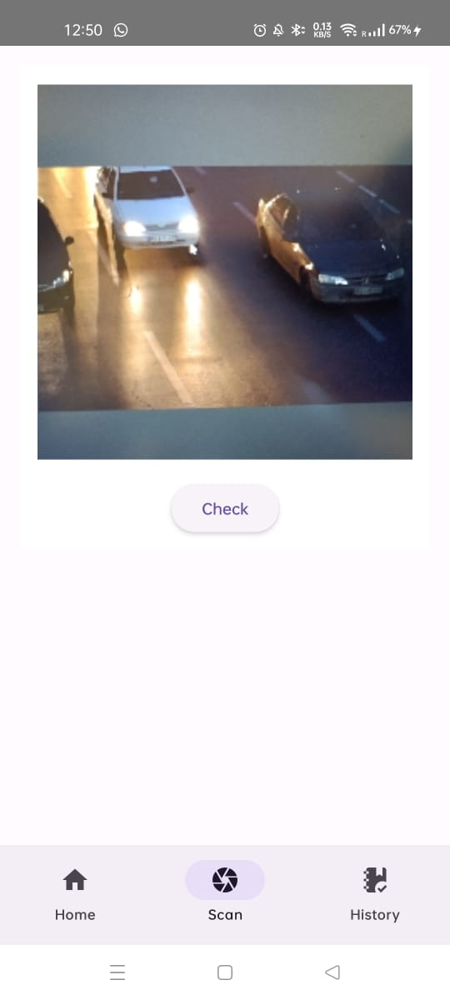
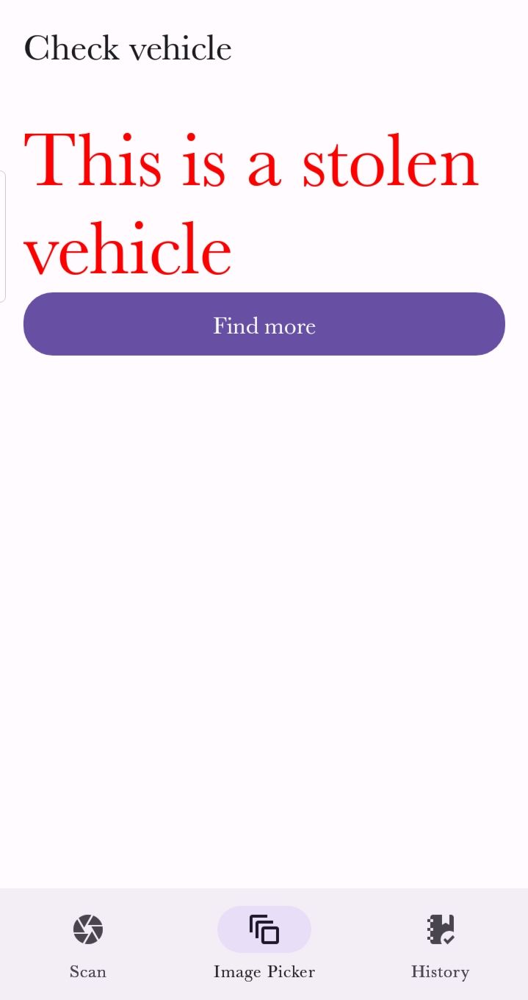

# Ethos IIT Guwahati Hackathon 
## **Smart Naka** - _The Champions_


Please check the PDF [Link]('https://drive.google.com/file/d/1Nr3nhFW_a3BHKXObGpNUpF_Fpq-gWYek/view?usp=sharing') Here 

Steps to Clone the repository 
## Demo
* Video Link [Link]('https://www.youtube.com/watch?v=jEDzbeAV_xY')
* Replit Link [Link]('https://replit.com/@devkanyal13/smart-naka')


**Working Demo** 
```
 Step 1 Home Page
```

<!-- 
**Step 2 Scan**  -->

```
Step 2 Scan 
```




```
Step 3 Scan the Registration Plate
```




```
Step 4 Verify the Registration Plate
```
<!--  -->


```
Step 5 Scan the whole vehicle 
```
<!--  -->


```
Step 6 Check the result
```
<!--  -->


</br>

1. Clone the Repository <br>
    ```
    git clone  "https://github.com/Pursottam6003/smart-naka"
    ```
2. To install all packages in Package.json() of android run 
    ```
    npm i 
    ```
3. Set up and install React Native CLI
4. Note : For running the app smoothly you are required to download and install **Android Studios** and run the *Emulator of SDK Manager*

Or Either use USB Debugging using your smart phone

5. After that it will install to your device 

6. For Backend authentication and Vehicle Detection 
```
cd server
```
7.  Install the packages
```
npm i
```
8. For Vehicle Detection using YOLO please check the README.md file [here](server\Vehicle-Detection\README.md) 


Thank You 